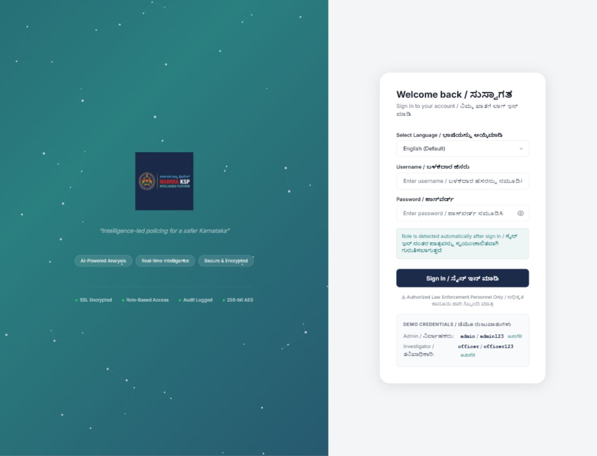
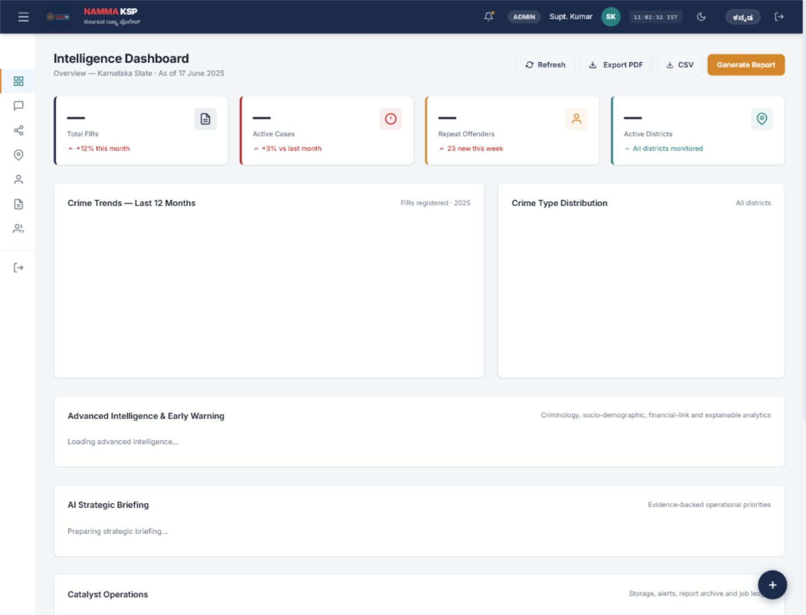
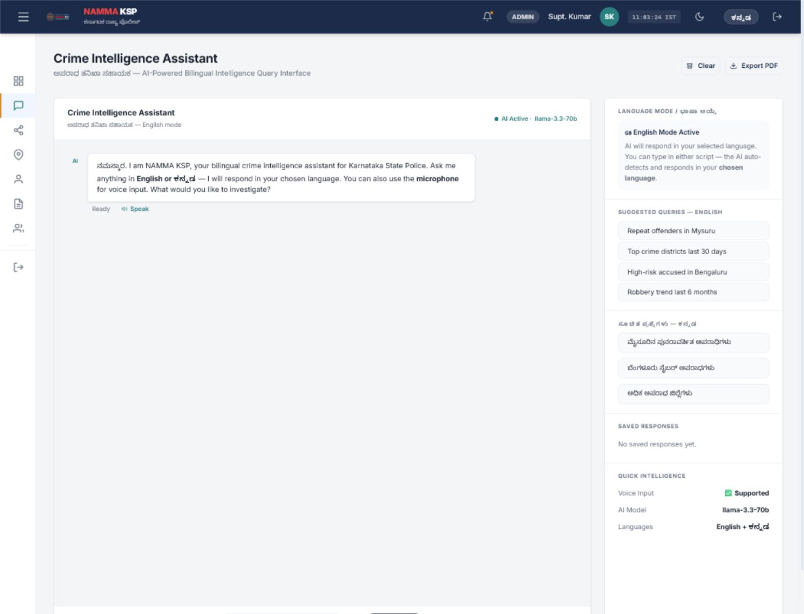
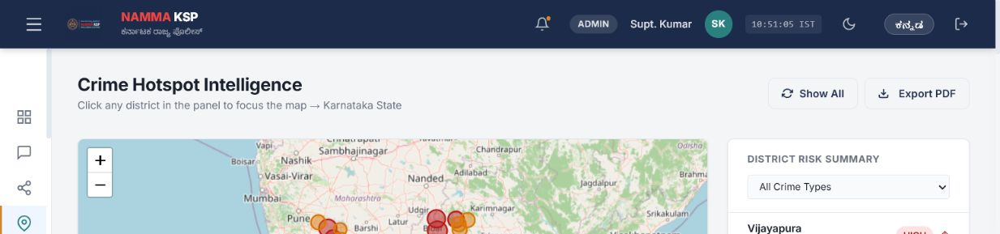
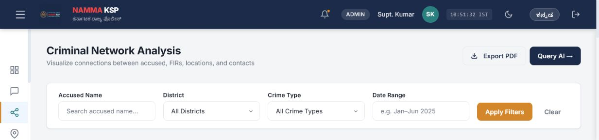
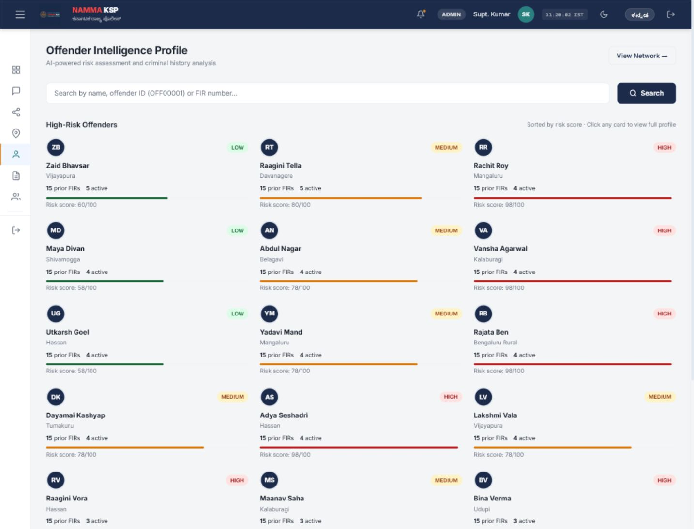
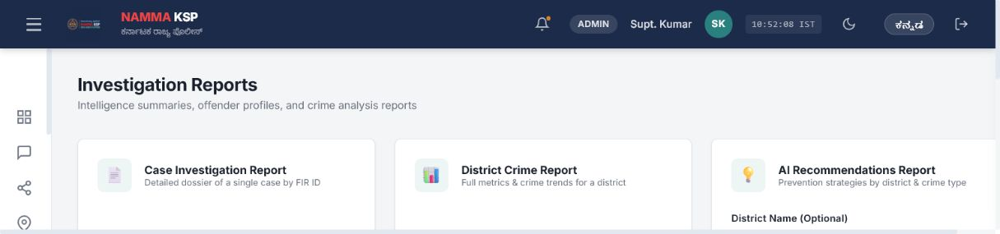

# NAMMA KSP

**Intelligent Conversational AI and Crime Analytics Platform for Karnataka State Police**

NAMMA KSP is a deployed Zoho Catalyst prototype that turns FIRs, offender history, victim records, locations, relationships, socio-economic indicators, and financial/cyber-adjacent patterns into an investigation-ready intelligence workspace. It is built for investigators, analysts, supervisors, and policymakers who need natural-language access to crime data plus explainable analytics, reports, and decision support.

[Live Catalyst App](https://nammaksp-60074625517.development.catalystserverless.in/app/index.html) | [Backend Health](https://namma-ksp-50043229029.development.catalystappsail.in/api/health)

## Website Screenshots

### Login and Automatic Role Detection



### Intelligence Dashboard



### AI Crime Assistant



### Crime Heatmap



### Criminal Network Analysis



### Offender Intelligence



### Investigation Reports



## Why This Project Exists

Crime investigation data is usually scattered across FIR records, accused/offender histories, victims, locations, case notes, financial clues, and station-level updates. That makes it hard to quickly identify repeat offenders, organized crime links, emerging hotspots, social risk factors, and cases needing urgent attention.

NAMMA KSP solves this by combining conversational AI, visual analytics, criminology-driven profiling, network intelligence, forecasting, and PDF reporting in one secure web application.

## Datathon Coverage

| Requirement | NAMMA KSP Coverage |
|---|---|
| Conversational crime intelligence | English/Kannada AI chat for FIRs, accused, victims, locations, status, summaries, and follow-up investigation questions. |
| Conversation history PDF | Report module and PDF generation support structured investigation outputs and archived downloads. |
| Voice interaction | Browser speech support with bilingual response playback and stop/start controls. |
| Criminal network analysis | Offender-victim-FIR-location relationship graph with repeat offender and association discovery. |
| Pattern and trend analytics | Dashboard KPIs, monthly trends, crime type distribution, hotspot intelligence, and district analytics. |
| Sociological insights | Socio-economic indicator dataset and proxy-based district risk interpretation. |
| Offender profiling | Repeat offender detection, prior FIR count, risk banding, behavioral indicators, and profile reports. |
| Investigator decision support | AI strategic briefing, case summaries, recommendations, similar-pattern reasoning, and report exports. |
| Financial crime link analysis | Financial transaction dataset support for suspicious account and cyber/financial pattern analysis. |
| Forecasting and early warning | Explainable moving-average forecasting, hotspot scoring, and early warning indicators. |
| Explainable AI | Dashboard evidence cards, data-backed summaries, and report-ready reasoning outputs. |
| Secure access and governance | Role-based login, automatic role detection, protected routes, and prototype governance controls. |

## Core Modules

| Module | What It Delivers |
|---|---|
| Intelligence Dashboard | Total FIRs, active cases, repeat offenders, districts, crime trends, distribution charts, and AI strategic briefing. |
| AI Assistant | Natural-language investigation Q&A with bilingual support and structured responses. |
| Crime Heatmap | District and location-level hotspot visualization across Karnataka. |
| Criminal Network | Relationship mapping across offenders, victims, FIRs, and locations. |
| Offender Profiles | Risk category, demographic context, previous FIRs, behavioral signals, and dossier-ready details. |
| Investigation Reports | Case, district, offender, recommendation, and network reports with PDF export and archive workflow. |
| Role-Based Access | Admin and investigator access without manual role selection on the login screen. |

## Demo Login

| Role | Username | Password |
|---|---|---|
| Admin | `admin` | `admin123` |
| Investigator | `officer` | `officer123` |

## Technology Stack

| Layer | Technologies |
|---|---|
| Frontend | HTML, CSS, JavaScript |
| Backend | Python, FastAPI, SQLite, Pandas, NetworkX, Scikit-Learn |
| Visualizations | Chart.js, Leaflet.js, Cytoscape.js |
| AI | Groq API |
| Reports | ReportLab PDF generation with bilingual font support |
| Deployment | Zoho Catalyst Web Client Hosting and AppSail |

## Dataset

The prototype uses the uploaded project datasets as the source of truth for analytics and demonstrations.

| File | Purpose |
|---|---|
| `data/firs.csv` | FIR records, crime type, station, status, timeline, and location references. |
| `data/offenders.csv` | Accused/offender identity, risk labels, repeat history, and profile attributes. |
| `data/victims.csv` | Victim details for case and relationship analysis. |
| `data/locations.csv` | District, station, and coordinate data for maps and hotspots. |
| `data/relationships.csv` | Links between FIRs, offenders, victims, and locations for network intelligence. |
| `data/financial_transactions.csv` | Financial/cyber-adjacent transaction signals for link analysis. |
| `data/socio_economic_indicators.csv` | District-level social indicators used for sociological crime insights. |

## Project Structure

```text
NAMMAKSP/
|-- backend/
|   |-- main.py
|   |-- database.py
|   |-- analytics.py
|   |-- network.py
|   |-- ai_service.py
|   |-- report.py
|   `-- fonts/
|-- data/
|-- docs/
|   `-- screenshots/
|-- frontend/
|   |-- index.html
|   |-- dashboard.html
|   |-- chat.html
|   |-- heatmap.html
|   |-- network.html
|   |-- offenders.html
|   |-- reports.html
|   |-- app.js
|   `-- style.css
|-- reports/
|-- requirements.txt
|-- app-config.json
`-- README.md
```

## Local Setup

```bash
git clone https://github.com/Sameer8549/NAMMAKSP.git
cd NAMMAKSP
python -m venv .venv
```

Activate the environment on Windows PowerShell:

```powershell
.\.venv\Scripts\Activate.ps1
```

Install dependencies:

```bash
pip install -r requirements.txt
```

Create `.env` from `.env.example` and configure keys:

```env
GROQ_API_KEY=your_groq_api_key_here
MISTRAL_API_KEY=your_mistral_api_key_here
GROQ_MODEL=llama-3.3-70b-versatile
```

Run locally:

```bash
uvicorn backend.main:app --host 127.0.0.1 --port 8000
```

Open:

```text
http://127.0.0.1:8000/
```

## Catalyst Deployment

| Component | Catalyst Service |
|---|---|
| Frontend | Catalyst Web Client Hosting |
| Backend API | Catalyst AppSail |
| Runtime | Python 3.12 |

Frontend:

```text
https://nammaksp-60074625517.development.catalystserverless.in/app/index.html
```

Backend:

```text
https://namma-ksp-50043229029.development.catalystappsail.in
```

## API Overview

| Method | Endpoint | Description |
|---|---|---|
| `GET` | `/api/health` | Health check and dataset summary. |
| `POST` | `/api/auth/login` | Login and automatic role detection. |
| `GET` | `/api/analytics/overview` | Dashboard KPIs. |
| `GET` | `/api/analytics/crime-types` | Crime type distribution. |
| `GET` | `/api/analytics/monthly-trends` | Monthly trend analytics. |
| `GET` | `/api/analytics/districts` | District analytics. |
| `GET` | `/api/firs` | FIR search and filters. |
| `GET` | `/api/firs/{fir_id}` | FIR details. |
| `GET` | `/api/offenders/{offender_id}` | Offender profile. |
| `GET` | `/api/network` | Criminal network graph. |
| `GET` | `/api/hotspots` | Crime hotspot data. |
| `POST` | `/api/chat` | AI investigation assistant. |
| `POST` | `/api/tts` | Text-to-speech generation. |
| `POST` | `/api/reports/case` | Case PDF report. |
| `POST` | `/api/reports/district` | District PDF report. |
| `POST` | `/api/reports/offender` | Offender dossier PDF. |
| `POST` | `/api/reports/network` | Network analysis PDF. |
| `GET` | `/api/reports/list` | Generated report archive. |
| `GET` | `/api/docs` | FastAPI Swagger documentation. |

## Impact

NAMMA KSP helps investigation teams move from raw records to operational intelligence:

1. Faster FIR and offender discovery.
2. Stronger repeat-offender prioritization.
3. Clearer district hotspot and trend understanding.
4. Visual criminal relationship discovery.
5. Bilingual AI-assisted investigation workflows.
6. Exportable reports for reviews, briefings, and submissions.

## Notes

- This is a datathon prototype, not a replacement for official police systems.
- AI output must be reviewed before operational, legal, or disciplinary use.
- Sensitive keys should be configured through environment variables or Catalyst settings, never committed to GitHub.
- The uploaded datasets are treated as the project source data for prototype analytics.

## License

Built for prototype, hackathon, and datathon evaluation use.
