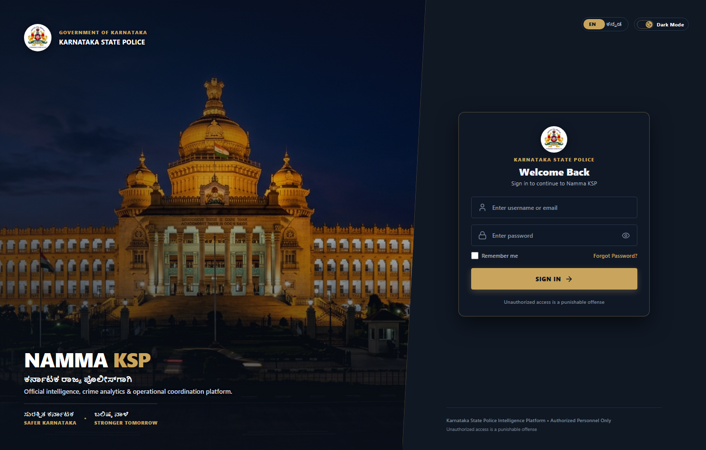
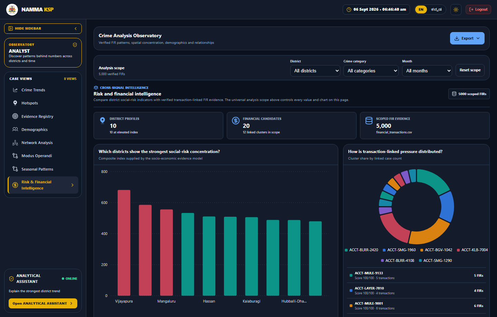
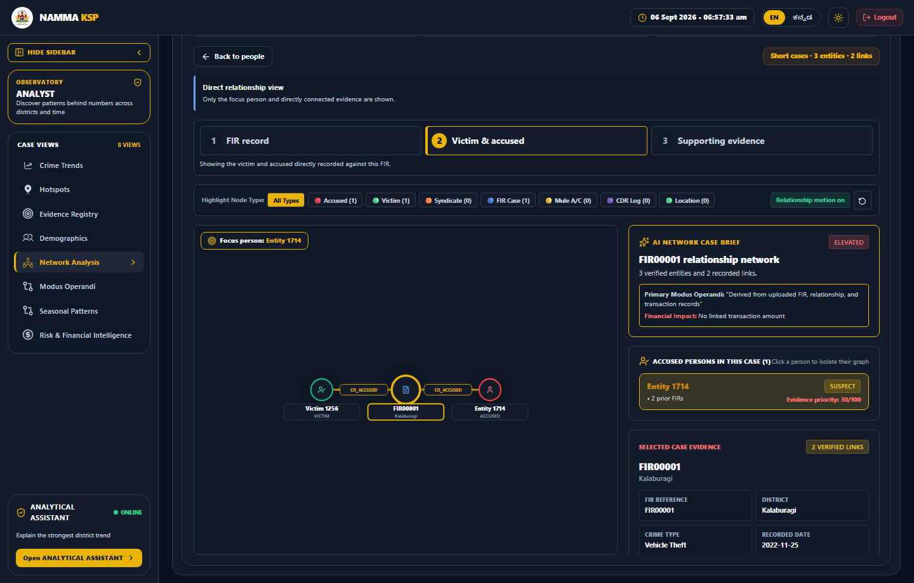
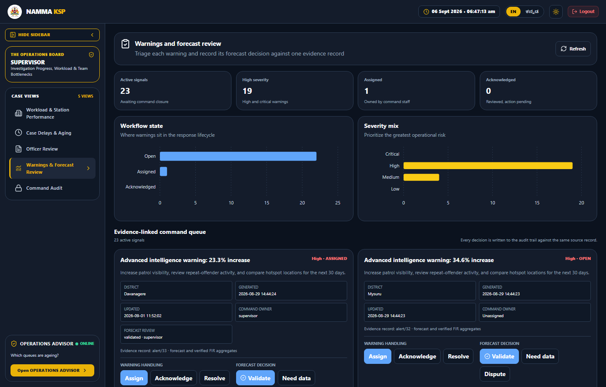
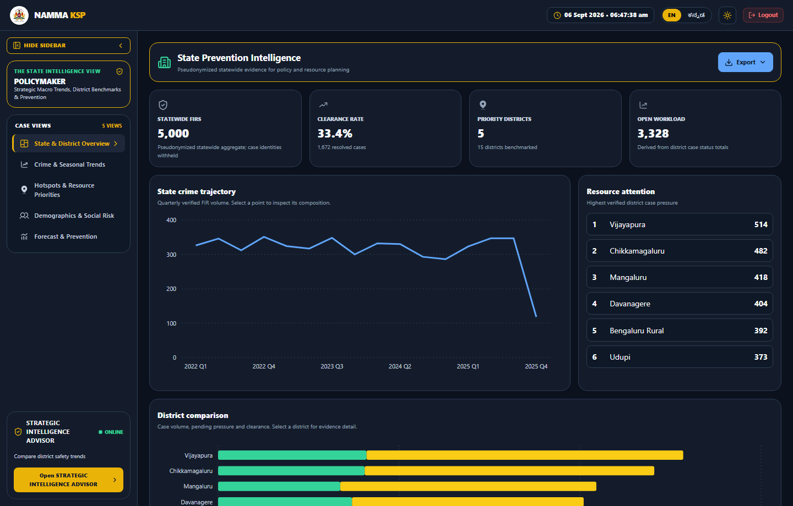
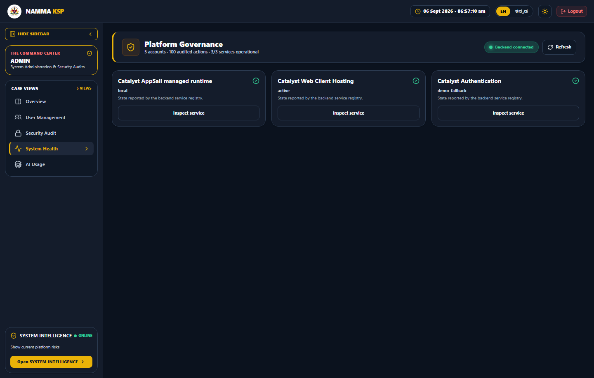
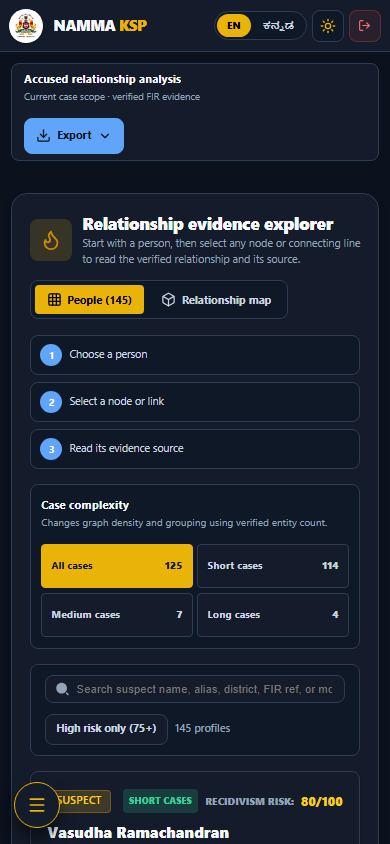
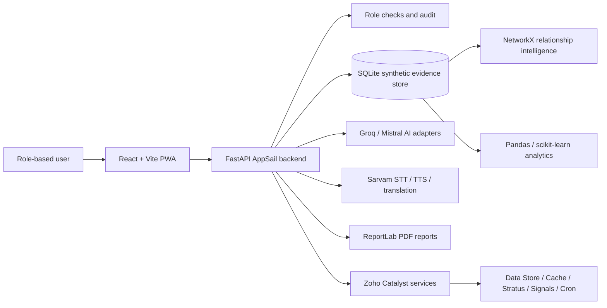
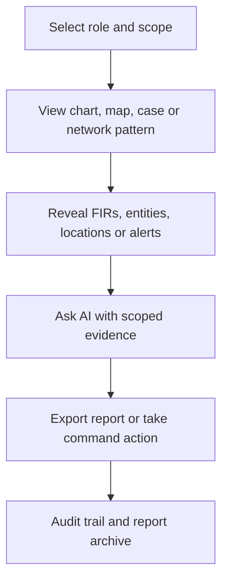

# NAMMA KSP

**Intelligent Conversational AI and Crime Analytics Platform for Karnataka State Police**

[](#)
[](#technology-stack)
[](#technology-stack)
[](#progressive-web-app)
[](#catalyst-deployment)
[](#prototype-boundary)

NAMMA KSP converts synthetic FIR records into role-aware crime intelligence. Investigators can inspect cases, analysts can discover patterns and relationships, supervisors can manage command pressure, policymakers can plan prevention, and administrators can govern the platform.

The central product idea: **every click should become traceable intelligence**. A chart mark reveals FIR evidence. A network node reveals linked accused, victims and locations. An AI answer cites platform data. A supervisor action writes to the command audit. A report preserves the selected scope.

> This is a final-round datathon prototype built on synthetic data. It does not claim legal proof, production-grade forecasting, or readiness for real police records without governance approvals.

## Live Prototype

| Surface | URL |
|---|---|
| Live AppSail app | [namma-ksp-50043229029.development.catalystappsail.in](https://namma-ksp-50043229029.development.catalystappsail.in/) |
| Backend health | [namma-ksp-50043229029.development.catalystappsail.in/api/health](https://namma-ksp-50043229029.development.catalystappsail.in/api/health) |
| API docs | [namma-ksp-50043229029.development.catalystappsail.in/api/docs](https://namma-ksp-50043229029.development.catalystappsail.in/api/docs) |

Demo accounts remain enabled for judging access. Production deployment requires KSP identity federation and formal access governance.

## Product Preview

### Login And Role Entry



### Analyst Crime Intelligence Workspace



### Relationship Network Intelligence



### Supervisor Command Workspace



### Policymaker Prevention Intelligence



### Admin Governance



### Mobile Network Analysis



## Why It Exists

Police intelligence work becomes slow when FIRs, accused profiles, victim records, locations, station workload, warnings, reports and policy indicators sit in separate places. NAMMA KSP brings those signals into one governed workflow:

1. Ask a natural-language question.
2. Scope evidence by role and permissions.
3. Retrieve FIR, entity, district, alert and report data.
4. Analyze patterns, hotspots, networks and forecasts.
5. Explain the evidence trail.
6. Export a report or write an audited command action.

## Role-Based Workspaces

| Role | Workspace purpose | Key capabilities |
|---|---|---|
| Investigator / Officer | Case action and investigation support | FIR search, case detail, similar cases, timelines, leads, reports and AI assistance |
| Analyst | Pattern discovery and intelligence production | Trends, hotspots, evidence registry, demographics, network analysis, modus operandi, seasonal patterns and risk-financial views |
| Supervisor | Operational command and workload intervention | Workload distribution, station performance, aging cases, delay tracking, officer review, warnings, forecast review and command audit |
| Policymaker | State-level prevention and resource planning | District comparison, crime-family trends, hotspots, demographic risk, forecast planning signals and prevention priorities |
| Admin | Platform governance | User management, security audit, service health, AI usage, report archive and Catalyst service evidence |

## Progressive Web App

NAMMA KSP is packaged as an installable PWA so the prototype feels closer to an operational field tool than a normal browser page.

| PWA capability | Current implementation |
|---|---|
| Installable app shell | `frontend-next/manifest.webmanifest` with Karnataka/KSP app icons |
| Offline shell | Workbox service worker precaches the app shell and static assets |
| Mobile-first access | Responsive role workspaces and mobile network/report views |
| Faster repeat visits | Cached HTML, CSS, JS, icons and key visual assets |
| Deployment portability | Served through Catalyst Web Client Hosting under `/app/` |

Operational meaning:

- Officers and reviewers can reopen the app quickly after installation.
- The UI shell can load even when connectivity is weak.
- Sensitive live data still requires backend/API access; the PWA shell is not a substitute for secure online evidence retrieval.

## Challenge Coverage

| Problem statement requirement | NAMMA KSP implementation |
|---|---|
| Conversational crime intelligence | English/Kannada chat, role-aware answers, follow-up context, voice path and PDF conversation export |
| FIR, accused, victim and location retrieval | Search and evidence views over synthetic FIR, offender, victim, location and relationship records |
| Criminal network analysis | FIR-to-accused-to-victim-to-location graph, centrality, communities and repeat links |
| Crime pattern analytics | Monthly/yearly trends, district comparison, hotspots, modus operandi and seasonal views |
| Sociological insights | District socio-economic joins for literacy, population density and social-risk comparison |
| Offender profiling | Repeat offender detection, transparent risk factors, linked cases and dossier export |
| Investigator decision support | Case summaries, related cases, timelines, suggested leads and investigation reports |
| Financial link analysis | Synthetic AML-style transaction links and account relationship graph |
| Forecasting and early warning | Backtested monitor, prediction intervals, warning queue and supervisor review lifecycle |
| Explainable AI | Source references, evidence trails, limitation notes and audit-backed actions |
| Secure access and governance | Role-based access, audit logs, field projection, pseudonymized policy views and service checks |

## Dataset

The repository uses synthetic demonstration data.

| Dataset | Count | Used for |
|---|---:|---|
| FIR records | 5,000 | Case search, analytics, reports and AI answers |
| Offender records | 2,000 | Repeat-offender analysis and profiling |
| Victim records | 3,000 | Victim analysis and network relationships |
| Location records | 100 | Maps, hotspots and district context |
| Relationship records | 5,000 | Evidence graph construction |
| Financial transactions | 20 | Demonstration transaction-link analysis |
| Socio-economic rows | 15 | District-level social-risk indicators |

## Architecture


```mermaid
flowchart LR
  User[Role-based user] --> PWA[React + Vite PWA]
  PWA --> API[FastAPI AppSail backend]
  API --> Auth[Role checks and audit]
  API --> DB[(SQLite synthetic evidence store)]
  API --> AI[Groq / Mistral AI adapters]
  API --> Voice[Sarvam STT / TTS / translation]
  API --> Reports[ReportLab PDF reports]
  API --> Catalyst[Zoho Catalyst services]
  DB --> Graph[NetworkX relationship intelligence]
  DB --> Analytics[Pandas / scikit-learn analytics]
  Catalyst --> Store[Data Store / Cache / Stratus / Signals / Cron]
```

## Evidence-First Interaction Model


```mermaid
flowchart TD
  Scope[Select role and scope] --> Pattern[View chart, map, case or network pattern]
  Pattern --> Evidence[Reveal FIRs, entities, locations or alerts]
  Evidence --> Assistant[Ask AI with scoped evidence]
  Assistant --> Action[Export report or take command action]
  Action --> Audit[Audit trail and report archive]
```

## Technology Stack

| Layer | Technologies |
|---|---|
| Frontend | React 19, TypeScript, Vite, TanStack Query, TanStack Table, ECharts, Lucide icons |
| PWA | Web App Manifest, Workbox service worker, precache routing, Karnataka/KSP app icons |
| Backend | Python, FastAPI, SQLite, Pandas, NetworkX, scikit-learn |
| AI | Groq and Mistral provider adapters, role-aware evidence retrieval, response normalization |
| Voice and language | Sarvam AI speech-to-text, text-to-speech and English/Kannada translation adapters |
| Reports | ReportLab PDF generation, report archive, evidence-scoped downloads |
| Maps | Google Maps / 3D map integration with graceful configuration checks |
| Deployment | Zoho Catalyst Web Client Hosting, AppSail, API Gateway, Data Store, Cache, Stratus, Signals, Cron and Pipelines |

## Catalyst Deployment

The live prototype uses Catalyst services for the web client, backend runtime, routing, evidence storage adapters, caching, report storage, scheduled intelligence refresh and early-warning events.

| Capability | Catalyst service |
|---|---|
| Frontend and PWA hosting | Web Client Hosting |
| Backend runtime | AppSail |
| API routing | API Gateway |
| FIR evidence table | Data Store |
| Analytics acceleration | Cache |
| Report archive | Stratus |
| Scheduled refresh | Cron |
| Early-warning events | Signals |
| CI/CD path | Pipelines |

Latest documented verification: **9 services verified, 0 failed**. See [Catalyst services coverage](docs/CATALYST_SERVICES.md).

## Local Development

### 1. Clone And Install

```bash
git clone https://github.com/rohith-yp/datathon.git
cd datathon
npm install
python -m venv .venv
```

On Windows PowerShell:

```powershell
.\.venv\Scripts\Activate.ps1
pip install -r requirements.txt
```

### 2. Configure Environment

Create `.env` from `.env.example` and configure provider keys as needed.

```env
GROQ_API_KEY=your_groq_api_key
MISTRAL_API_KEY=your_mistral_api_key
SARVAM_API_KEY=your_sarvam_api_key
GOOGLE_MAPS_API_KEY=your_google_maps_key
DEMO_MODE=true
```

Never commit real API keys or police data.

### 3. Run Backend

```powershell
.\.venv\Scripts\uvicorn.exe backend.main:app --host 127.0.0.1 --port 8000
```

### 4. Build Frontend

```bash
npm run build:ui
```

For frontend development, use Vite according to the current project configuration.

## Useful Commands

```bash
npm run check:ui
npm run build:ui
npm run test:ui
```

```powershell
.\.venv\Scripts\python.exe -m pytest
```

## API Highlights

| Endpoint | Purpose |
|---|---|
| `GET /api/health` | Runtime and dataset health |
| `GET /api/submission/readiness` | Challenge-readiness evidence |
| `GET /api/catalyst/services` | Catalyst service evidence matrix |
| `GET /api/firs` | FIR search and filters |
| `GET /api/network` | Relationship graph |
| `GET /api/hotspots` | Hotspot evidence |
| `POST /api/chat` | Evidence-aware AI assistant |
| `POST /api/audio-transcribe` | Voice transcription |
| `POST /api/tts` | Text-to-speech |
| `POST /api/translate` | English/Kannada translation |
| `POST /api/reports/*` | Evidence-scoped PDF reports |

## Prototype Boundary

This repository is a datathon prototype, not a production police records system.

Do not overclaim:

- Network communities are association evidence, not legal proof of organized crime.
- Forecasting is monitor-only/planning-signal-only until statistically validated on real operational data.
- Demo auth exists for judges and must be replaced by production identity federation before real use.
- Multi-instance AppSail write consistency is not claimed until concurrent writer testing is complete.
- Synthetic data must not be described as official KSP evidence.
- The PWA offline shell does not make protected evidence available offline.

## Documentation

| Document | Purpose |
|---|---|
| [Full system dossier](docs/NAMMA_KSP_FULL_SYSTEM_DOSSIER.md) | End-to-end product, role, AI, analytics and deployment explanation |
| [PWA PPT notes](docs/NAMMA_KSP_PWA_PPT_DETAILS.md) | PWA-only slide and speaker-note material |
| [Additional evidence strategy](docs/NAMMA_KSP_ADDITIONAL_DETAILS_AND_EVIDENCE_STRATEGY.md) | PPT and judge-Q&A material around evidence-first interaction |
| [Challenge coverage](docs/CHALLENGE_COVERAGE.md) | Problem statement capability map |
| [Challenge audit](docs/CHALLENGE_AUDIT_2026-09-05.md) | Honest implementation evidence and remaining limitations |
| [Catalyst services](docs/CATALYST_SERVICES.md) | Catalyst service usage and status meanings |
| [Security](SECURITY.md) | Security posture |
| [Limitations](LIMITATIONS.md) | Known boundaries |
| [Ethics](ETHICS.md) | Responsible-use framing |

## Final-Round Positioning

NAMMA KSP is strongest when presented as an evidence-aware decision platform:

- Investigators act on cases.
- Analysts discover hidden patterns.
- Supervisors manage operational pressure.
- Policymakers plan prevention.
- Admins govern the system.

The prototype demonstrates a full loop from question to evidence to insight to report or audited action.
