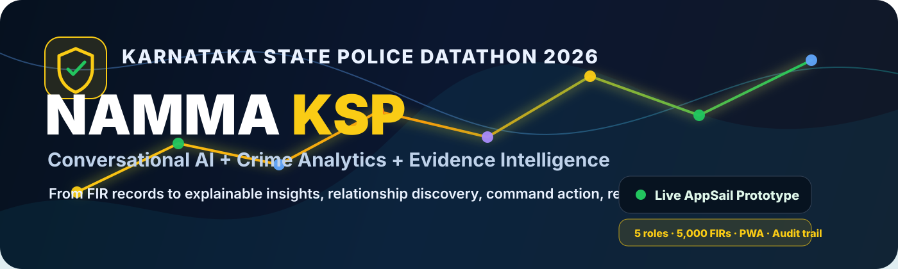
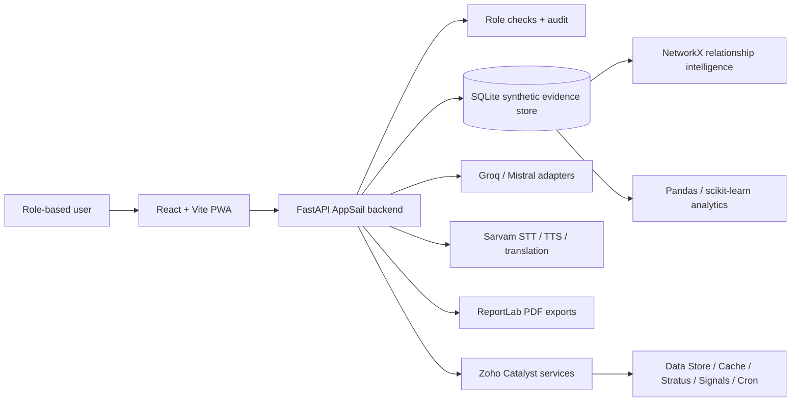
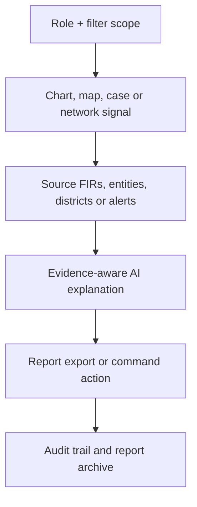

<p align="center">
  
</p>

# NAMMA KSP

**Intelligent Conversational AI and Crime Analytics Platform for Karnataka State Police**

[](#)
[](#technology-stack)
[](#technology-stack)
[](#progressive-web-app)
[](#live-prototype)
[](#prototype-boundary)

NAMMA KSP turns synthetic FIR records into a role-aware crime intelligence platform for investigators, analysts, supervisors, policymakers and administrators.

The product idea is not "show a dashboard." It is stronger than that: **every click becomes traceable intelligence**. A chart mark reveals FIR evidence. A network node reveals linked accused and victims. An AI answer cites platform data. A supervisor decision writes to the command audit. A report preserves the selected scope.

> Final-round datathon prototype. Built for synthetic-data demonstration, not production policing without official identity, data-governance and model-validation gates.

## Live Prototype

| Surface | Link |
|---|---|
| Live AppSail app | [namma-ksp-50043229029.development.catalystappsail.in](https://namma-ksp-50043229029.development.catalystappsail.in/) |
| Backend health | [api/health](https://namma-ksp-50043229029.development.catalystappsail.in/api/health) |
| API docs | [api/docs](https://namma-ksp-50043229029.development.catalystappsail.in/api/docs) |

Demo accounts remain enabled for judging access. Production use requires KSP identity federation.

## Visual Tour

### Login And Role Entry


### Analyst Intelligence Workspace


### Relationship Network Intelligence


### Supervisor Command Workspace


### Policymaker Prevention Intelligence


### Admin Governance


### Mobile Network View


## What It Solves

Police intelligence work slows down when FIRs, accused profiles, victim records, locations, station pressure, warnings, reports and policy indicators are split across separate systems. NAMMA KSP joins them into one evidence-aware workflow:

1. Ask a natural-language question.
2. Scope evidence by role and permission.
3. Retrieve FIR, entity, district, alert and report data.
4. Analyze patterns, hotspots, relationships and forecasts.
5. Explain what evidence supports the result.
6. Export a report or write an audited command action.

## Role Workspaces

| Role | Decision layer | What the workspace does |
|---|---|---|
| Investigator / Officer | Case action | FIR search, case detail, timelines, similar cases, leads, reports and AI support |
| Analyst | Pattern discovery | Trends, hotspots, evidence registry, demographics, network analysis, modus operandi, seasonal patterns and risk-financial intelligence |
| Supervisor | Command intervention | Workload, station performance, aging cases, officer review, warnings, forecast review and command audit |
| Policymaker | Prevention planning | Statewide aggregates, district comparison, social risk, resource priorities and forecast planning signals |
| Admin | Platform governance | User management, audit logs, AI usage, service health, report archive and Catalyst evidence |

## Challenge Coverage

| Requirement | Coverage |
|---|---|
| Conversational crime intelligence | English/Kannada chat, role-aware answers, follow-up context, voice path and PDF conversation export |
| FIR, accused, victim and location retrieval | Search and evidence views across synthetic FIR, offender, victim, location and relationship records |
| Criminal network analysis | FIR-to-accused-to-victim-to-location graph, centrality, communities and repeat links |
| Crime pattern analytics | Monthly/yearly trends, district comparison, hotspots, modus operandi and seasonal views |
| Sociological insights | District socio-economic joins for literacy, population density and social-risk comparison |
| Offender profiling | Repeat-offender detection, transparent risk factors, linked cases and dossier export |
| Decision support | Case summaries, related cases, timelines, suggested leads and investigation reports |
| Financial link analysis | Synthetic AML-style transaction links and account relationship graph |
| Forecasting and early warning | Backtested monitor, prediction intervals, warning queue and supervisor lifecycle |
| Explainable AI | Source references, evidence trails, limitation notes and audit-backed actions |
| Access and governance | Role-based access, audit logs, pseudonymized policy views and service checks |

## Dataset

| Synthetic dataset | Count | Used for |
|---|---:|---|
| FIR records | 5,000 | Search, analytics, reports and AI answers |
| Offender records | 2,000 | Repeat-offender analysis and profiling |
| Victim records | 3,000 | Victim analysis and network relationships |
| Location records | 100 | Maps, hotspots and district context |
| Relationship records | 5,000 | Evidence graph construction |
| Financial transactions | 20 | Demonstration transaction-link analysis |
| Socio-economic rows | 15 | District-level social-risk indicators |

## Architecture


```mermaid
flowchart LR
  User[Role-based user] --> PWA[React + Vite PWA]
  PWA --> API[FastAPI AppSail backend]
  API --> Auth[Role checks + audit]
  API --> DB[(SQLite synthetic evidence store)]
  API --> AI[Groq / Mistral adapters]
  API --> Voice[Sarvam STT / TTS / translation]
  API --> Reports[ReportLab PDF exports]
  API --> Catalyst[Zoho Catalyst services]
  DB --> Graph[NetworkX relationship intelligence]
  DB --> Analytics[Pandas / scikit-learn analytics]
  Catalyst --> Store[Data Store / Cache / Stratus / Signals / Cron]
```

## Evidence Loop


```mermaid
flowchart TD
  Scope[Role + filter scope] --> Signal[Chart, map, case or network signal]
  Signal --> Evidence[Source FIRs, entities, districts or alerts]
  Evidence --> AI[Evidence-aware AI explanation]
  AI --> Action[Report export or command action]
  Action --> Audit[Audit trail and report archive]
```

## Progressive Web App

NAMMA KSP is packaged as an installable PWA so it behaves more like an operational app shell than a temporary web page.

| PWA capability | Implementation |
|---|---|
| Installable shell | `frontend-next/manifest.webmanifest` |
| Branded icons | `pwa-192.png`, `pwa-512.png`, `favicon.png` |
| Offline shell | Workbox service worker precaches static app assets |
| Mobile-ready use | Responsive role workspaces and mobile network view |
| Secure boundary | Protected evidence still requires authenticated backend APIs |

## Technology Stack

| Layer | Technologies |
|---|---|
| Frontend | React 19, TypeScript, Vite, TanStack Query, TanStack Table, ECharts, Lucide icons |
| PWA | Web App Manifest, Workbox service worker, precache routing, Karnataka/KSP app icons |
| Backend | Python, FastAPI, SQLite, Pandas, NetworkX, scikit-learn |
| AI | Groq and Mistral adapters, role-aware retrieval, response normalization |
| Voice/language | Sarvam speech-to-text, text-to-speech and English/Kannada translation adapters |
| Reports | ReportLab PDF generation, report archive, evidence-scoped downloads |
| Maps | Google Maps / 3D map integration with graceful configuration checks |
| Deployment | Zoho Catalyst Web Client Hosting, AppSail, API Gateway, Data Store, Cache, Stratus, Signals, Cron and Pipelines |

## Local Development

```bash
git clone https://github.com/Sameer8549/NAMMAKSP.git
cd NAMMAKSP
npm install
python -m venv .venv
```

```powershell
.\.venv\Scripts\Activate.ps1
pip install -r requirements.txt
.\.venv\Scripts\uvicorn.exe backend.main:app --host 127.0.0.1 --port 8000
```

```bash
cd web-client
npm install
npm run dev
```

## Useful Commands

```bash
npm run check:ui
npm run build:ui
npm run test:ui
```

```powershell
.\.venv\Scripts\python.exe -m pytest
```

## API Highlights

| Endpoint | Purpose |
|---|---|
| `GET /api/health` | Runtime and dataset health |
| `GET /api/submission/readiness` | Challenge-readiness evidence |
| `GET /api/catalyst/services` | Catalyst service evidence matrix |
| `GET /api/firs` | FIR search and filters |
| `GET /api/network` | Relationship graph |
| `GET /api/hotspots` | Hotspot evidence |
| `POST /api/chat` | Evidence-aware AI assistant |
| `POST /api/audio-transcribe` | Voice transcription |
| `POST /api/tts` | Text-to-speech |
| `POST /api/translate` | English/Kannada translation |
| `POST /api/reports/*` | Evidence-scoped PDF reports |

## Prototype Boundary

Do not overclaim this prototype:

- Network communities are association evidence, not legal proof of organized crime.
- Forecasting is monitor-only/planning-signal-only until validated on operational data.
- Demo auth exists for judges and must be replaced by production identity federation.
- Multi-instance AppSail write consistency is not claimed until concurrent writer testing is complete.
- Synthetic data must not be described as official KSP evidence.
- The PWA offline shell does not make protected evidence available offline.

## Documentation

| Document | Purpose |
|---|---|
| [Full system dossier](docs/NAMMA_KSP_FULL_SYSTEM_DOSSIER.md) | Product, role, AI, analytics and deployment explanation |
| [PWA PPT notes](docs/NAMMA_KSP_PWA_PPT_DETAILS.md) | PWA-only slide and speaker-note material |
| [Additional evidence strategy](docs/NAMMA_KSP_ADDITIONAL_DETAILS_AND_EVIDENCE_STRATEGY.md) | Judge Q&A and evidence-first positioning |
| [Challenge coverage](docs/CHALLENGE_COVERAGE.md) | Problem statement capability map |
| [Challenge audit](docs/CHALLENGE_AUDIT_2026-09-05.md) | Implementation evidence and remaining limitations |
| [Catalyst services](docs/CATALYST_SERVICES.md) | Catalyst service usage and status meanings |

## Final-Round Positioning

NAMMA KSP is an evidence-aware decision platform:

- Investigators act on cases.
- Analysts discover hidden patterns.
- Supervisors manage operational pressure.
- Policymakers plan prevention.
- Admins govern the system.

The prototype demonstrates a full path from question to evidence to insight to report or audited action.
